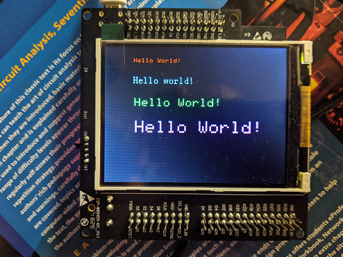

## SPI LCD Text Example

This code displays strings on the 320x240 LCD on an ESP-WROVER-KIT board using the espressif IDF.

</img>

Lib is optimized for rapid drawing. Font blocks are pre-computed and bulk transfered for rapid updates.  


API example: 

```c
    //Initialize the LCD
    lcd_init(spi);

    // Draw text on screen 
    drawStringX(spi,"Hello World!",50,20,0);

    // Set foreground to Cyan & background to black 
    setTextColor(ILI9341_CYAN, ILI9341_BLACK); 

    // Test alternate font 
    drawString8_16(spi,"Hello world!",50,50);
    setTextColor(ILI9341_GREEN, ILI9341_BLACK);
    
    // Test larger scales 
    drawStringX(spi,"Hello World!",50,90,1);
    setTextColor(ILI9341_MAGENTA, ILI9341_BLACK);
    drawStringX(spi,"Hello World!",50,130,2);
```

### Credits 

Code borrows from: 

https://github.com/MartyMacGyver/ESP32_Adafruit_ILI9341
https://github.com/lexus2k/ssd1306
